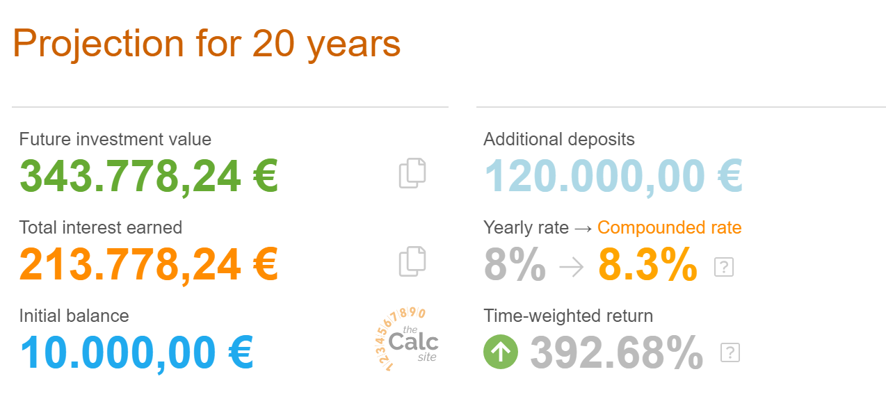

## Introduction: Why Budgeting & Saving Matter

Budgeting and saving are your roadmap to financial security and success. They help you track your money, avoid financial stress, and reach your life goals. Particularly, it's through budgeting and saving that you are able to take advantage of **compound interest**.

--------------------------------------------------
- [Compound interest explained in one minute](https://www.youtube.com/watch?v=jTW777ENc3cCompound)

--------------------------------------------------

Studies show that 78% of Americans live paycheck to paycheck, even those earning more than $100,000 a year (CareerBuilder, 2017). Without a budget or savings plan, even the most financially comfortable individuals can struggle. That's what happens when lifestyle inflation creeps in:

--------------------------------------------------
- [7 Signs you are a Victim of Lifestyle Inflation](https://youtube.com/watch?v=gqlUyzYREZc)

--------------------------------------------------

A lot of people confuse the terms "avoiding lifestyle inflation" with the concept of "not living your life". But, we disagree. We believe that budgeting, saving and investing is the way to live a comfortable life (for longer) while being happy.

Budgeting helps you stay in control of your money, saving ensures you're ready for unexpected expenses and future goals, while investing makes your money grow. In this first week, we'll cover the first two (investing will be covered next week).

## 1. What is a Budget?
A budget is a financial plan that helps you manage your money. It’s about knowing where every euro is going instead of wondering where it went.

A solid budget prevents overspending,  encourages savings and avoids guilt.

Key Components of a Budget:

**Income:** Your total earnings (salary, freelance, side hustle, dividends, etc.).
**Expenses:*** Money going out (rent, groceries, utilities, entertainment).
**Savings:** Money you’re setting aside for future needs (emergencies, investments, big purchases).

## 2. The 50/30/20 Rule for Budgeting

One of the most popular and effective methods for budgeting is the 50/30/20 rule. It provides a simple structure to manage your money:

50% for Needs: Rent, utilities, groceries, transportation—essential expenses.
30% for Wants: Dining out, entertainment, vacations—non-essential spending.
20% for Savings & Debt Repayment: Emergency fund, investments, paying off credit cards or loans.
This method works because it balances living your life now (wants) with securing your future (savings).

Most budgets fit within some % levels as the ones we see above. But, if you want to get more aggressive and retire early, you can up the % of savings to 50 or 60%. Coupled with investment, this may mean that you no longer depend on your professional life to live. In this context, retirement doesn't necessarily mean *do nothing* - it means the freedom to choose what you want to do, even if it's nothing.

## 3. Types of Savings

Saving money isn’t just about putting it in a jar. There are different types of savings to consider, each with a specific purpose.

Emergency Fund: An emergency fund is your financial safety net. Experts suggest having at least 6 to 12 months of expenses set on the side, in case an emergency arrives. 

Short-Term Savings: These are savings for goals within the next 1-3 years, such as a vacation, a car, some new gadget, whatever.

Long-Term Savings: These are for future financial goals like retirement, buying a house, or your child’s education. Your savings will also also eaten by inflation, so you should find some nice places where to earn a good return. Amount of money saved + return will define the timeline for your retirement, and the earlier you start saving for long-term goals, the more you can benefit from compounding.

For example, Let's imagine that you earn 50.000 yearly and decide that ~20% of that money should go to savings:

- You start with 10.000€
- add 500€ every month to your investment account
- decide that you are conservative and use a savings account (*depósito a prazo*) that earns 1%.

In the end, you will earn about 15.000€ of interest in the period of 20 years. That doesn't seem very exciting..

But, what if we invest in a vehicle that yields 8% interest on average? 

We earn near 213k€ in interest over 20 years! How can that be? 

Compound interest, that is. If you want to play around with the calculator, feel free to do it [here].(https://www.thecalculatorsite.com/finance/calculators/compoundinterestcalculator.php)

Remember that we think that 20% savings is conservative? Let's be a more aggressive in our savings and save 50% of our income, meaning that we add roughly 1200 euros every month.

You earn almost 500k€ in interest! In the period of 20 years. Imagine the beach where you would be when you started to save when you were a little child :-) 
This return is just a bit rosy, as inflation kicks in. These 500k€ are worth a lot less in 20 years that what they are today - but, even so, an 8% average return will definitely surpass inflation. We'll dive into these topics a bit more during Week 2 of our learning pod.

## 4. Tools for Effective Budgeting
Managing your budget can be a breeze with modern financial tools. Here are some of the best options:

Mint: A free app that tracks all your accounts and spending in one place. It categorizes your expenses automatically and helps you stay on budget.
You Need a Budget (YNAB): This is a paid app that takes budgeting to the next level by assigning every dollar a specific job. It's perfect if you want to be more intentional with your money. According to YNAB, their average user saves over $6,000 in the first year.
Excel: If you like more control, building your own budget spreadsheet in Excel allows for flexibility and customization.
These tools help you stay on track and visualize your finances, making budgeting less of a chore and more of a habit.

5. How to Stick to Your Budget
Creating a budget is one thing, but sticking to it is a whole different challenge. Here are some tips to make sure you don’t fall off track:

Automate Your Savings: Set up an automatic transfer to your savings account each month. This makes saving easier, as you’ll pay yourself first before you’re tempted to spend.
Track Every Dollar: Keeping a close eye on your spending helps you stay disciplined. Apps like Mint or YNAB automatically categorize your purchases so you can see exactly where your money is going.
Review Monthly: Budgets aren’t static. Life changes, and so will your financial situation. Each month, take a look at your budget and adjust as needed.
Accountability Partner: Share your budgeting goals with a trusted friend or family member. They can help you stay accountable and provide support if you’re feeling tempted to overspend.
Tiffany Aliche, known as "The Budgetnista," offers this simple advice: “Budgeting doesn’t limit your freedom; it gives you freedom.” When you budget, you’re in control of your money, not the other way around.

6. The Importance of Saving
Saving isn’t just about planning for the future—it’s about peace of mind today. By saving regularly, you can avoid the panic that comes with unexpected expenses or emergencies.

Key Benefits of Saving:

Financial Security: Knowing you have money set aside gives you confidence to handle emergencies.
Freedom to Pursue Goals: Want to start a business? Travel the world? Early retirement? Saving gives you the freedom to pursue these life goals.
Reduces Stress: When you're not constantly worried about money, you can focus on enjoying life, spending time with loved ones, and pursuing your passions.
Conclusion: Take Control of Your Money
Budgeting and saving are essential habits for financial success. By creating a budget, sticking to it, and setting aside money for future goals, you’ll be on your way to a more secure and enjoyable life.

To wrap up, watch this engaging YouTube video by The Financial Diet, titled “How to Create a Simple Budget That Works”, for more budgeting inspiration and tips. Also, consider reading "Your Money or Your Life" by Vicki Robin, which explores how budgeting can transform your relationship with money.

Budgeting and saving may require effort at first, but the rewards—financial freedom, peace of mind, and the ability to achieve your dreams—are well worth it.

References
Warren, E. & Tyagi, A.W. (2005). All Your Worth: The Ultimate Lifetime Money Plan. Free Press.
Ramsey, D. (2017). The Total Money Makeover. Thomas Nelson.
Stephan, G. (2020). Why You Need an Emergency Fund. YouTube Video.
CareerBuilder. (2017). Living Paycheck to Paycheck Statistics.
The Financial Diet. (2020). How to Create a Simple Budget That Works. YouTube Video.