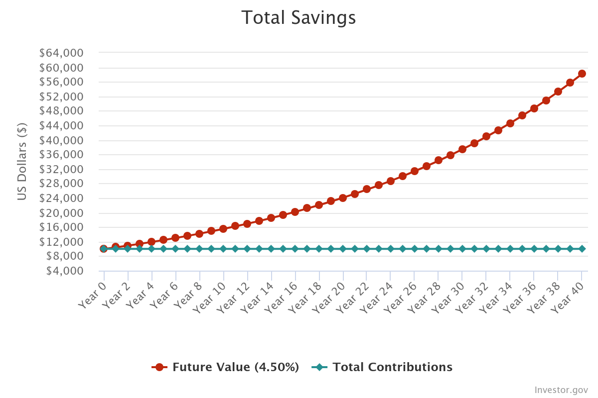

## Week 2: Introduction to Investing

Investing is a critical step toward building wealth and financial security. By putting your money into various assets, you give it the potential to grow faster than it would in a savings account alone. 

Investing isn’t about luck or risk; it’s about strategy, knowledge, and patience. This week, we’ll introduce the fundamentals of investing, different asset types, and some beginner strategies.

### 1. Why Invest?
While budgeting and saving lay a solid foundation, investing is what accelerates wealth-building. Investing grows your money through the power of compound returns (see week 1). Instead of your money sitting idle in a savings account, it works for you by generating returns. 

The key to successful investing is **time in the market**, not **timing the market**. We'll discuss this in more depth on Passive vs. Active investing week.  

### 2. Common Investment Types
Investing involves putting your money into different assets, that can make your money grow. Let’s break down the most common types:

*Stocks*: Contrary to what people believe, stocks aren't mostly speculative. They do contain some portion of "speculation" around their price but buying stocks means you own a small part of a company. If the company grows, so does the value of your stock, which you can sell for a profit. Owning stocks also entitles you to the profit of the company, paid via company dividends.

*Bonds*: Bonds are essentially loans you give to governments or corporations, which pay back with interest. They’re considered lower-risk than stocks, although most bonds are not risk free.

*Real Estate*: Owning property can be a profitable long-term investment. Real estate values typically appreciate over time, and can generate rental income. However, it does require more capital and maintenance.

*Mutual Funds & ETFs*: Mutual funds and Exchange-Traded Funds (ETFs) are collections of stocks and/or bonds. Instead of investing in individual stocks, you own shares in a fund that invests across various assets.

*Commodities*: Commodities include physical items like gold, silver, oil, and agricultural products. They are typically seen as a hedge against inflation but can be volatile.

*Cryptocurrencies*: These digital currencies are decentralized and operate outside traditional banking systems. While they can have high returns, they are also highly speculative and volatile and have less track record when it comes to future gains.

*Collectibles*: Anything related to collectible materials that may appreciate in future value like art, trading cards, action figures or others. These types of investments are highly speculative and intrinsic/future value may be very hard to calculate. 

### 3. Building a Balanced Portfolio
A balanced portfolio is about diversifying your investments to reduce risk. A simple way to think about it is:

60% Stocks for growth
30% Bonds for stability
10% Other assets (like commodities, real estate)
You can adjust these percentages based on your age, financial goals, and risk tolerance. As a general rule, younger investors can take on more risk (and therefore invest more in stocks), while older investors may shift toward other types of assets.

For example, in the past 40 years:

- S&P 500 has returned 10.5% (including dividends), on average.
- Gold has returned an average 4.1%.
- The price of a Treasury Bond has averaged a 6.4% return.

As we've seen in week 1, compound interest can really be affected by small changes in the average return. That is reflected also in different portfolios. There's a catch for higher returns: the higher the return, the more volatility you can expect on the asset's price (meaning that there will be abrupt changes in the value of the asset).

Take these 3 examples of portfolios: 

- Portfolio 1: 100% Stocks
- Portfolio 2: 50% stocks, 50% bonds.
- Portfolio 3: 40% stocks, 30 % bonds, 30% gold.

If we consider a period of 35 years, we can see the following: 

- (Portfolio 1) Investing 10k$ in 1987, we end up with 472k$ in 2024.
- (Portfolio 2) Investing 10k$ in 1987, we end up with 170k$ in 2024.
- (Portfolio 3) Investing 10k$ in 1987, we end up with 150k$ in 2024.

The difference is staggering - but three things are extremely important here:
- If you choose Portfolio 1, you would have to stomach (higher volatility) a 40% loss in 2008.
- The return on stocks in the past decade has been abnormally high.
- The values you see are not inflation adjusted.If you adjust the values for the total inflation, Portfolio 1 would only be able to be valued at 165k at the end of the analysis period. Next, we 'll speak a bit about inflation.

Want to try out some custom portfolios for you? Check out https://www.portfoliovisualizer.com/backtest-asset-class-allocation#analysisResults.

The important thing about allocation is:
- The higher your timeline to get your money back, the more invested in stocks you should be. If your time horizon is greater than 20 years, stocks are a good place to allocate your money.
- If you feel that you can't stomach a -40% loss in a given year, don't be too overweight in stock. If you sell during this period, most of your future return will be thrown out the window.
- Inflation will eat away your profits, independently of the allocation.

and speaking of inflation...

### 4. Inflation

Inflation is the silent killer of your money. Inflation is typically measured by CPI (here is Portugal's historical one: https://tradingeconomics.com/portugal/consumer-price-index-cpi). The CPI contains measurements about the  price of an average basket of goods (energy, food, real estate, etc.). 
Inflation is a byproduct of the economic system we live in, and naturally tied with economic growth (healthy economies target a level of inflation of around 1-2% per year).

It refers to the rate at which the general level of prices for goods and services rises over a period of time, leading to a decrease in purchasing power. It’s influenced by a variety of factors, including demand, supply, monetary policy, and external shocks (like energy prices).

But, inflation can eat away most of your long-term investment returns. Let's consider a 8% average return on a portfolio of different assets that we've invested in 1980:

We would have near 225.000$ at the end of a 40 year period. But this is just a virtual return. Why? If we account for inflation, the 225.000$ can only buy 58.000$ worth of goods and services 40 years later (considering 3.5% average inflation rate). So your real return actually looks like the following:

Inflation is a silent money killer and few assets have proven to be able to beat inflation on the long run (stocks, some bonds and gold (barely)). So next time you see that 2% interest rate on a "depósito a prazo"? Remember that inflation will kill that in the long run.

### 5. Beginner Investing Strategies
Start with a small amount: Investing doesn’t require thousands of dollars to begin. Many online brokers allow you to invest in small amounts or buy “fractional shares.”

Use Dollar-Cost Averaging (DCA) - for european Euro-Cost Averaging: DCA means investing a fixed amount regularly, regardless of the market’s ups and downs. **This minimizes the impact of short-term volatility and lowers the average cost of your investment over time.**

Think Long-Term: The market will have highs and lows, but historical data shows that the longer you stay invested, the more likely you are to see gains.

Choose a simple portfolio allocation: Don't get too fancy. Choose a simple portfolio allocation and buy a couple of ETFs that replicate the assets you want to buy.

### 6. Tools for Investing
Many apps simplify investing for beginners, such as:

- Degiro or InteractiveBrokers: These apps allow you to buy stocks, ETFs, and cryptocurrencies easily, with no minimum investment.
- Your Bank: Banks normally have brokerage services. But keep in mind that their pricing is normally higher than other e-platforms or online banks.
- Revolut: Revolut enables you to trade stocks inside their app (and even fractional shares).

## Assignment 2
For this week’s assignment, we’ll start small by buying your first investments. At the end of the assignment, you should:

- Create a investment portfolio: Include a mix of assets (e.g., stocks, bonds, gold, etc.) with approximate percentages. This portfolio should be based on your risk tolerance.
- Choose a platform or app: Decide where you’ll make your first investment and explore the platform’s features. We recommend Degiro or Revolut, for starters.
- Buy your first ETFs - Get together with one of your Learning Pod colleagues and buy your first ETF together! We recommend starting with 100€.

Next week, we'll see how Passive vs. Active investing differ!
