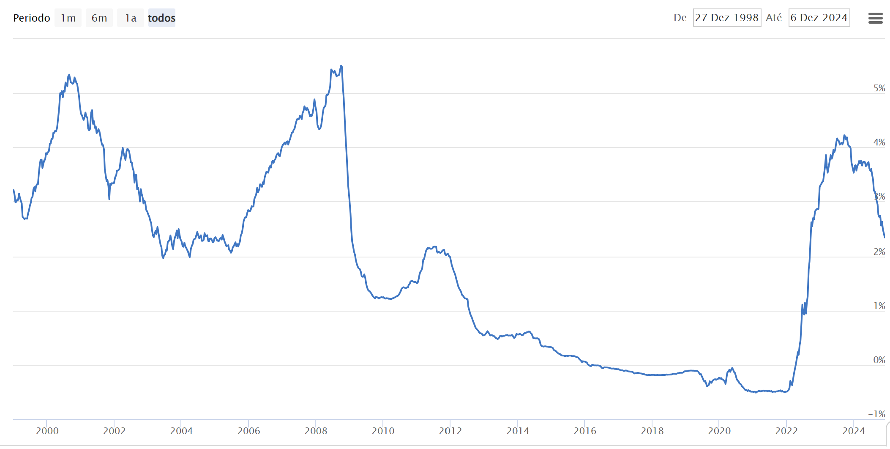

# Week 4: Managing Debt

Debt can be a double-edged sword — it has the power to help you achieve your financial goals but can also lead to significant stress if not managed carefully. In this week’s session, we’ll explore the essentials of debt management, helping you understand the types of debt, how to prioritize repayment, and strategies to keep debt under control while building a secure financial future.

## 1. Understanding Debt
Debt refers to borrowed money that you agree to repay, often with interest. It can be classified into two main categories:

- Good Debt: Debt that helps you build wealth or improve your financial situation over time. Examples include mortgages, student loans, or business loans, where the borrowing is linked to long-term financial growth.
- Bad Debt: Debt used to finance depreciating assets or consumption, such as high-interest credit card debt or payday loans. This type of debt often doesn’t generate value and can quickly become a financial burden if not managed carefully.

Bad debt (and good debt as well) can lead to **destroyed lives and families** - managing it is extremely important.

## 2. Why Managing Debt Matters
Unmanaged debt can lead to:

- High interest payments, reducing disposable income.
- Negative credit scores, impacting future financial opportunities.
- Increased stress and limited financial flexibility.
- Effective debt management ensures you use borrowing strategically, avoid unnecessary interest costs, and stay on track toward your financial goals.

## 4. Strategies for Staying Debt-Free
Once you’ve paid off or reduced your debt, the key is to stay in control. Here are some strategies to avoid falling into a debt trap:

- Emergency Fund: Maintain savings that cover at least 6-12 months of living expenses to handle unexpected costs.
- Budgeting: Track your income and expenses to avoid overspending.
- Avoid Impulse Purchases: Focus on needs over wants, especially for big-ticket items.
- Credit Card Discipline: Pay your balance in full every month to avoid interest charges and build a positive credit history.

## 5. When Is It Okay to Take On Debt?
While staying debt-free is ideal, there are situations where taking on debt is a practical decision. Examples include:

- Buying a home/real estate with a mortgage that fits your budget.
- Investing in education or training that increases earning potential.
- Starting or growing a business with a clear plan for repayment.
- The key is ensuring the benefits of the debt outweigh the costs, and the repayment plan aligns with your financial stability.

## 6. Mortgage Interest Rates

In the Portuguese Reality, there's often the choice between Fixed vs. Variable Mortgage Interest Rates.

When choosing a mortgage, one of the key decisions you'll face is whether to opt for a fixed or variable interest rate. Both options have their advantages and disadvantages, depending on your financial goals, risk tolerance, and the current economic environment. Here's a breakdown to help you make an informed decision:

### 6.1 Fixed Interest Rate Mortgage
A fixed-rate mortgage locks in your interest rate for the entire term of the loan or a set initial period (e.g., 5, 10, or 30 years). Fixed mortgage rates for longer terms are rare in Portugal.

Key Features:
- Predictability: Your monthly payments remain consistent, making it easier to budget.
- Stability: Protects you from rising interest rates during the term of the mortgage.
- Higher Initial Rate: Fixed rates are often slightly higher than variable rates at the outset.

Ideal For:
- Borrowers who prefer financial stability and consistent payments.
- Those who expect interest rates to rise in the future.
- Homebuyers with long-term financial plans who want to avoid surprises.

Example:
If your fixed rate is 4% on a 30-year mortgage, you’ll pay the same interest rate and monthly payment regardless of how market rates fluctuate.
When you 

For context, here are the interest rates applied in Portugal (Euribor, European Rate) in the past 20 years: 

### 6.2. Variable (Adjustable) Interest Rate Mortgage
A variable-rate mortgage (also called an adjustable-rate mortgage) has an interest rate that fluctuates based on market conditions, typically tied to a benchmark like EURIBOR.

Key Features:
- Lower Initial Rate: Often starts with a lower interest rate than fixed-rate mortgages.
- Rate Adjustments: Interest rates can increase or decrease over time, causing monthly payments to fluctuate.
- Potential for Savings: You may save money if rates stay low during your mortgage term.

Example:
A variable mortgage might start with a 3% rate for the first 5 years (initial period), then adjust annually based on market rates. If rates rise to 5%, your payments will increase accordingly.

## 7. Choosing the Right Option
Consider a Fixed-Rate Mortgage If:
- You value predictability and want a steady financial plan.
- You expect interest rates to rise over time.

Consider a Variable-Rate Mortgage If:
- You’re comfortable with some financial risk in exchange for potentially lower costs.
- You expect interest rates to remain low or decline.
- You plan to sell, move, or refinance before the adjustable period ends.

## 8. Assignment 4
This week’s assignment is designed to help you assess and improve your debt management strategies. By the end of the assignment, you should:

- Evaluate Your Current Debt Situation: Create a list of all your debts, including amounts, interest rates, and repayment terms.
- Set a Budget: Identify areas where you can cut back on spending to allocate more toward debt repayment.
- Learn About Interest Rates: Research the interest rates on your debts and explore options to refinance or consolidate to lower costs.
